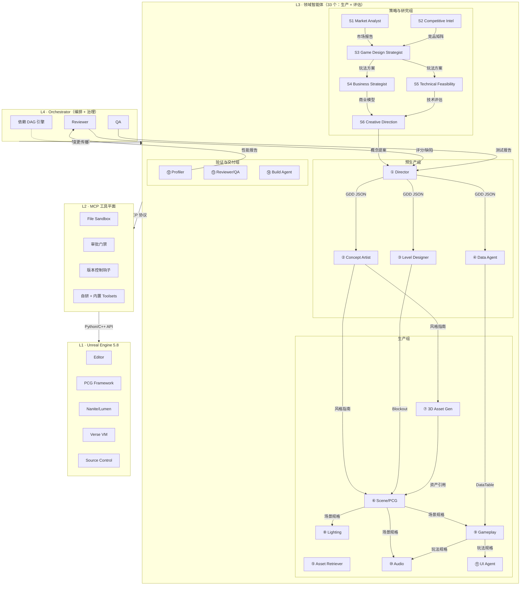

# AI Agent 工具链架构方案

面向 AI 技术专家和小团队，基于 Unreal Engine 5.8 LTS。我们想让 AI Agent 承担大部分游戏生产工作，把人的精力留给真正需要判断力的地方。

---

## 概述

这套架构的核心不是"用 AI 写代码"，而是用开放标准（MCP）加自研编排，把一系列 AI Agent 组成一支可治理、可验证、可回滚的工程团队。UE 在这里是被驱动的执行引擎，不是把人锁住的平台。

投入重点在两层：L2（自研 Toolset）和 L4（编排与治理）。这两层全部源码自研，不绑定任何模型供应商，UE6 迁移时可以平滑复用。L3 的 33 个领域与评估 Agent 覆盖从市场调研到打包发布及上线后复盘再开发的完整工业管线。

---

## 目录

- [0. 设计原则](#0-设计原则)
- [1. 总体架构](#1-总体架构)
- [2. 领域智能体设计](#2-领域智能体设计)
  - [2.1 策略与研究组](#21-策略与研究组strategy--research)
  - [2.2 预生产组](#22-预生产组)
  - [2.3 生产组](#23-生产组)
  - [2.4 验证与交付组](#24-验证与交付组)
  - [2.5 Agent 间通信](#25-agent-间通信)
  - [2.6 变更传播](#26-变更传播上游改了下游要知道)
- [3. MCP 工具平面](#3-mcp-工具平面)
- [4. PCG 与 AI 的结合](#4-pcg-与-ai-的结合)
- [5. 外部生成能力](#5-外部生成能力)
- [6. 编排层](#6-编排层)
- [7. 端到端工作流示例](#7-端到端工作流示例)
- [8. 落地路线图](#8-落地路线图)
- [9. 风险与应对](#9-风险与应对)
- [10. 术语表](#10-术语表)
- [参考依据](#参考依据)
- [关联文档](#关联文档)

---

## 0. 设计原则

三条底线，所有架构取舍都锚在这上面。

**原则一：Agent 只生成构建脚本，不直接产出最终资源**

Agent 不凭空造 .uasset。它产出的是 PCG 图、编辑器 Python 脚本、C++/Verse 代码、DataAsset。这些是构建脚本，最终资源由引擎在本地确定性地编译生成。好处很直接：资源可以进 Git、可以 diff、可以复现。

**原则二：每一步都进闭环验证**

Generation → Compile → Run → Screenshot → Fix。Agent 每次改动之后必须自检——截图回传、日志解析、跑自动化测试。AutoUE 的论文已经验证了这件事：把自动化游玩测试嵌进生成循环里，是让产物真正可玩的关键。

**原则三：源码可控是底线**

引擎级改造——比如把推理嵌进渲染管线、定制 Agent 沙箱、扩展 PCG 框架——这些只有拿着完整 UE 源码才做得动。工具链本体（Orchestrator、RAG、评测系统）也必须源码自研，不依赖任何闭源 AI 产品。

---

## 1. 总体架构

四层，自底向上：

```
┌─────────────────────────────────────────────────────────────┐
│  L4  自研 Orchestrator（编排 + 治理）                         │
│  依赖 DAG 引擎 / Reviewer / QA                                │
├─────────────────────────────────────────────────────────────┤
│  L3  领域智能体层（33 个 Agent：生产 + 评估）                 │
│  预生产组 / 生产组 / 验证与交付组                              │
│  统一通过 MCP 协议调用工具，模型可随时替换                     │
├─────────────────────────────────────────────────────────────┤
│  L2  MCP 工具平面（Toolset Registry）                         │
│  12 个自研 Toolset + 内置 Toolsets + File Sandbox + 审批门禁   │
├─────────────────────────────────────────────────────────────┤
│  L1  Unreal Engine 5.8（完整源码 + 可重编译）                 │
│  Editor / PCG / Nanite / Lumen / Verse / Source Control       │
└─────────────────────────────────────────────────────────────┘
```

L2、L3、L4 全部走开放标准加自研代码。UE 是被驱动的执行引擎，换模型、升 UE6、甚至换引擎，影响范围都被压在 L2 的适配层里。



---

## 2. 领域智能体设计

AutoUE（ACL'26 Findings）用 5 个 Agent 跑通了端到端生成 3D 游戏的流程，证明这条路可行。我们在这个基础上，对照工业游戏管线的实际环节，扩展到 **33 个 Agent**，按生产阶段分组。Agent 之间不传自然语言，只传结构化的 JSON 规格（SharedState）。

> 生产型 Agent（策略 S1–S6 / 预生产 / 生产 / 验证与交付）负责把游戏做出来；**评估型 Agent**（体验评估 E1–E6 + UX/Playtest 研究者 + 叙事内容 W1 + 技术美术 TA）负责批判性地找出问题、保证品质与商业可行。评估不是交付末尾的一次性检查，而是可在任意里程碑触发的反馈闭环，且与生产的读写严格分离。

### 2.1 策略与研究组（Strategy & Research）

工业级游戏开发在动工之前有一个"绿光阶段"（Greenlight）——市场分析、竞品研究、玩法概念验证、商业模型推演。这些工作传统上由发行商的产品团队或独立工作室的核心主创完成，耗时数月。我们把这套流程 Agent 化，让 AI 在确定方向之前，先做足功课。

这组 Agent 的输入是模糊的"我想做游戏"——甚至只是一个念头。输出是一份结构化的《游戏概念提案》（Game Concept Proposal），包含市场数据支撑、竞品分析、玩法方案、商业模型和风险评估。提案由人工审阅和选择后，才进入 Director 的 GDD 拆解流程。

| Agent | 输入 | 输出 | 关键工具 | 优先级 |
|---|---|---|---|---|
| S1 Market & Audience Analyst | 品类/风格方向（模糊） | 市场趋势报告 + 用户画像 + 市场规模估算 | 市场数据 API、SteamDB、舆情分析 | P1 |
| S2 Competitive Intelligence | 目标品类 + 对标作品 | 竞品矩阵 + 差异化分析 + 机会缺口报告 | 竞品数据库、特征对比引擎 | P1 |
| S3 Game Design Strategist | 品类方向 + 竞品分析 | 核心玩法方案 + 机制设计 + 玩家体验模型 | LLM + 玩法模式库 + 设计理论 RAG | P1 |
| S4 Business & Platform Strategist | 品类 + 目标用户 + 玩法方案 | 收入模型 + 平台策略 + 定价方案 + 盈亏推演 | 财务模型引擎、平台政策库 | P1 |
| S5 Technical Feasibility Analyst | 玩法方案 + 美术方向 + 平台策略 | 技术可行性报告 + 范围估算 + 风险清单 | 引擎能力库、性能基准数据 | P1 |
| S6 Creative Direction Strategist | 品类 + 竞品分析 + 用户画像 | 世界观框架 + 叙事方向 + 视觉/音频策略 + 情绪板 | 外部图像生成 API、参考库 RAG | P1 |

这六个 Agent 协同工作的流程：

1. 用户输入一个模糊方向——比如"我想做一款黑暗奇幻的动作游戏"
2. Market & Audience Analyst 拉取市场数据：这个品类过去 3 年的收入趋势、Steam 同时在线峰值、用户评价分布、目标人群画像
3. Competitive Intelligence 扫描竞品：列出同品类 Top 20 游戏，逐项对比 feature、定价、评价、差异化机会
4. Game Design Strategist 基于市场缺口和竞品分析，提出 2–3 套核心玩法方案，每套方案包含玩法循环、机制概要、玩家体验曲线
5. Business & Platform Strategist 对每套方案做商业推演：收入模型、定价策略、平台分成对比、18 个月盈亏预测
6. Technical Feasibility Analyst 评估每套方案的技术可行性：UE 5.8 能否支撑、需要哪些 Toolset 扩展、关键风险点
7. Creative Direction Strategist 为入选方案生成世界观框架、叙事基调、视觉参考情绪板和音频策略

最终产出是一份 15–20 页的《游戏概念提案》，包含数据可视化图表和可交互的对比矩阵。人工审阅后选择方向，提案中的结构化数据直接注入 Director 的 GDD 生成流程。

### 2.2 预生产组

方向确定后，预生产组开始细化"做什么"和"长什么样"。

| Agent | 输入 | 输出 | 关键工具 | 优先级 |
|---|---|---|---|---|
| ① Director | 用户意图 | GDD + 任务拆解（JSON） | LLM + RAG | P2 |
| ② Concept Artist | GDD 美术描述 | 风格指南 + 参考图 + 视觉规范 | 外部图像生成 API | P2 |
| ③ Level Designer | GDD + 风格指南 | Blockout 规格（动线/POI/空间分区/节奏曲线） | python_execute, Blockout Toolset | P1 |
| ④ Data Agent | 玩法数值规格 | CSV → DataTable 资产 | Data Toolset | P2 |
| W1 Writer | GDD + 世界观 | 剧情/对话/情境文本 + 文案资产 | LLM + 叙事模板 RAG | P2 |
| ND System / Numerical Designer | GDD + 玩法方案 | 成长曲线 / 资源经验产出 / 战斗数值平衡 / 经济回收规格 | LLM + 数值设计理论 RAG + 平衡仿真 | P1 |

Director 把用户的一句话需求展开成结构化的 GDD 和任务清单。Concept Artist 先确定关卡的视觉基调——色调、材质语言、光照 mood——后面所有资产生成都绑在这个风格指南上。Level Designer 在 PCG 铺场景之前，先用简单几何体拉出灰盒：玩家从哪进、经过哪、在哪高潮、从哪出，动线节奏是什么样的。Data Agent 管数值的**落地**——收集品计数、触发条件、敌人参数——全部走 CSV 进 DataTable，不散落在代码里。W1 Writer 承接 GDD 和世界观框架，产出带命名的剧情片段、人物对白、情境描述和可读文案（任务目标、物品说明、关卡内提示），以结构化文本资产供 Gameplay / UI / Audio 引用。

**ND System / Numerical Designer 与 ④ Data Agent 的分工**：④ 是"数值的录入与资产化"（把已定好的规格写成 CSV、建 DataTable）；ND 才是"数值/经济的设计决策者"——负责成长曲线、经验/资源产出速率、战斗数值平衡（伤害/血量/难度梯度）、经济回收。两者职责不同，不可混用：ND 产出数值设计规格（喂给 Gameplay、敌人/Boss 设计），④ 负责把它落地成引擎可读的 DataTable。

**垂直切片 / 玩法原型阶段**：正式全量生产前，预生产组必须经历一轮**垂直切片（Vertical Slice）**——由 Director 从 GDD 裁出一段最小的核心玩法循环（一个可玩区块：探索→收集→解谜→战斗），让 ⑥ Scene/PCG、⑨ Gameplay、角色类 Agent、数值设计先把它做到"手感成立"。垂直切片是玩法风险对冲：在此阶段验证"核心循环真的好玩"、技术可行、艺术基调成立，通过后才进入全量生产；否则带着结论回退调整再切片。这是对标大厂"prototype / greenlight / vertical-slice gate"的关键前期环节，避免全量内容做完才暴露核心玩法无趣。

### 2.3 生产组

预生产定了方向，生产组开始实际产出。

| Agent | 输入 | 输出 | 关键工具 | 优先级 |
|---|---|---|---|---|
| ⑤ Asset Retriever | 资产需求规格 | Fab/Quixel/本地库资产引用列表 | 资产检索 Toolset | P1 |
| ⑥ Scene/PCG | Blockout + 资产引用 + 风格指南 | PCG 图 + 生成脚本 + 截图 | PCG Toolset, python_execute | P1 |
| ⑦ 3D Asset Generator | 风格指南 + 资产规格 | 纹理/网格/材质（外部模型，在风格约束下生成） | 外部生成 API + ArtPipeline Toolset | P3 |
| ⑧ Lighting | PCG 场景 + 风格指南 | 光源放置 + PostProcess Volume | Lighting Toolset | P1 |
| ⑨ Gameplay | 玩法规格 + Blockout + DataTable + 文案 | Verse/C++ 模块 + 编译 | Build Toolset, 源码 | P2 |
| ⑩ Audio | 场景描述 + 玩法规格 | 环境音 + SFX 放置 | Audio Toolset, 外部音频生成 API | P2 |
| ⑪ UI | 玩法规格 + DataTable + 文案 | UMG Widget（HUD/交互提示） | UI Toolset | P2 |
| TA Technical Artist | 风格指南 + 资产 | 主材质/shader/渲染规范 + 资产技术校验 + 性能优化建议 | ArtPipeline, Material Toolset, Profiler | P1 |
| PC Player Character Designer | GDD + 风格指南 | 玩家角色设定（体感/动作风格/成长/手感 KPI） | LLM + 动作设计理论 RAG | P1 |
| EB Enemy & Boss Designer | GDD + ND 数值规格 | 敌人/Boss 白皮书（行为/攻击模式/数值/难度曲线） | LLM + 竞品行为库 RAG | P1 |
| AN Animation Agent | PC/EB 角色规格 + 风格指南 | 动作状态机 + 动画实现 + 外购动画质检（IK/locomotion） | 外部动画 API + ArtPipeline | P1 |

Asset Retriever 先从 Fab、Quixel 和本地库里找现成资产，找不到的才交给 3D Asset Generator（P3 才接入外部生成模型）。Scene/PCG 拿到 Blockout 和资产引用之后，搭 PCG 图、触发生成、截图回传。Lighting 根据风格指南布光——主光源、局部补光、PostProcess Volume——然后截图跟 Concept Artist 的参考图比对。Gameplay 写 Verse 或 C++ 的交互逻辑和状态机，编译通过才算完。Audio 和 UI 是为可玩性服务的——没有音效和 HUD 的 Demo 不是完整的 Demo。TA Technical Artist 是"生产组的规范守护者"——搭主材质和 shader、定渲染规范（纹理尺寸/精度/LOD）、对生成资产做技术校验（三角面、UV、碰撞、Nanite 开关），并把 Profiler 报出来的超标点转化成具体的优化方案。

**角色与动作是动作冒险游戏的主干，不能只有"能动的 Actor"**：
- **PC Player Character Designer** 定义玩家角色的体感与动作风格——移动/跳跃/攀爬手感、招式节奏、成长方向，并给出可量化的**手感 KPI**（响应延迟、连招容错、位移手感），供 Gameplay/Animation 实现和 E 评估验收。
- **EB Enemy & Boss Designer** 产出敌人与 Boss 的"白皮书"——行为模式、攻击套路、受击反馈、血量/难度曲线（对应 ND 的数值基线），避免敌人只有"巡逻/追击/攻击"三种状态。
- **AN Animation Agent** 负责 Locomotion / IK / Animation Blueprint 状态机与外购动画的技术质检（骨骼对齐、根运动、通道），把外部生成的动作资产落入角色/敌人。

这三者共同把玩家的**操控感和反馈感**做出来；否则 Demo 能跑能收集，但角色僵、战斗空。

### 2.4 验证与交付组

全部产出进验证闭环。

| Agent | 输入 | 输出 | 关键工具 | 优先级 |
|---|---|---|---|---|
| ⑫ Profiler | 完整关卡 | GPU/CPU Profile 报告 + 超标区域标记 | Profiler Toolset, Unreal Insights | P2 |
| ⑬ Reviewer/QA | 全部产物 | 缺陷报告 + 评分 | Automation Test, Screenshot, Playtest | P2 |
| ⑭ Build Agent | 通过评审的关卡 | 平台可执行包 | Build Toolset (UBT), Package Toolset | P3 |

Profiler 跑一遍 GPU 和 CPU profiling，标出超标区域，反馈给 Scene 和 Lighting 做针对性优化。Reviewer 做**工程审验**——代码审查、资产规范检查、PIE 自动化测试，最后给一个分数。评分低于 70 或者有 critical bug 就退回对应 Agent 重做。Build Agent 在 P3 才接入——前面的阶段都在 PIE 里验证，P3 才真打包。

> **Reviewer 是全生命周期的工程审验；评估组（下一节）是站在用户/市场立场的批判审验。** 两者必须分开：Reviewer 验证"做没做对"（工程正确性），评估组验证"值不值得做、用户爱不爱、能否赚钱"（产品生死题）。回退阈值由"工程分 ∪ 体验分 ∪ 商业分"任一不达标触发。

### 2.5 评估组（Evaluation）

> 这是与"生产/工程评审"解耦的**用户立场批判层**。前端承诺的 8 个"评估型 Agent"，除 W1（叙事内容评价）与 TA（技术美术评价）外，正式落地为 **E1–E6 六类**，全部**只读、`strong` 模型**、只写 `shared_state/eval/`，永远不写生产产物区——防止"被评估方污染评估方"，保持监督性。

| Agent | 评估对象 | 批判视角 | 输入 → 输出 |
|---|---|---|---|
| E1 Experience Auditor | 关卡节奏 / 动线 / 挫败与成就感曲线 | 核心玩家的耐心与沉浸 | blockout + 播放录制 → 体验痛点清单（哪里无聊/卡顿/劝退） |
| E2 Content Critic | 美术风格 / 场景氛围 / 音频一致性 / UI 可用性 | 视觉/听觉敏感用户 | 风格指南 + 截图 + 场景渲染 → 素材不符合预期的点 |
| E3 Gameplay / Fun Auditor | 核心玩法循环 / 战斗手感 / 成长曲线 / 数值平衡 | 硬核玩家（对标《战神》《艾尔登法环》） | 玩法规格 + DataTable + 实机 → 机制无聊点 / 数值失衡 / 手感问题 |
| E4 Design & Economy Judge | 关卡结构 / 解谜 / 收集奖惩 / 时间经济 | 进度导向玩家 | blockout + 数值 + 通关数据 → 关卡问题 / 收集鸡肋点 / 经济崩点 |
| E5 Monetization & Market Fit | 定价 / 内容量 / 平台 / 回收模型 | 商人与发行视角 | business_model + S4 输出 → 内容量 vs 定价是否成立 |
| E6 Benchmark & Horizontal | 与现有游戏的横向全维度对比 | 市场/测评博主视角 | S2 竞品矩阵 + S1 市场 + 实机产物 → 对照评分表 + 受欢迎度预测 + GO/NO-GO/PIVOT |

配套的 UX / Playtest 研究者与评估用 Toolset（PlaytestToolset、BenchmarkToolset）、`eval/*` 数据契约和回退规则见 [技术设计](./AI_Agent_Game_Dev_TechDesign.md) §5.2 / §4.3。

### 2.6 Agent 间通信

所有 Agent 之间的交接走 SharedState——结构化的 JSON，附 Schema 约束。不传自由文本，因为自由文本不可靠、不可校验、不可追踪。

Level Designer 给 Scene Agent 的 Blockout 规格：

```json
{
  "$schema": "https://project/schemas/blockout-spec.json",
  "version": "1.0.0",
  "parent_hash": "sha256:gdd-task-0042-v3",
  "level_name": "Forest_Ruins_01",
  "player_path": {
    "waypoints": [
      { "id": "spawn", "x": 0, "y": 0, "z": 0, "type": "spawn" },
      { "id": "gate_puzzle", "x": 1200, "y": -400, "z": 0, "type": "poi" },
      { "id": "boss_arena", "x": 3000, "y": -800, "z": 0, "type": "boss" },
      { "id": "exit", "x": 5000, "y": 0, "z": 0, "type": "exit" }
    ],
    "pacing_curve": "slow_intro → puzzle_peak → exploration_valley → boss_climax"
  },
  "zones": [
    {
      "name": "forest_entrance",
      "bounds": { "min": [0, 0], "max": [1500, 1500] },
      "biome": "temperate_forest",
      "poi": ["ancient_archway", "overgrown_path"],
      "intensity": 0.2
    }
  ],
  "constraints": {
    "max_asset_count": 500,
    "target_fps": 60,
    "forbidden_zones": ["/Game/Maps/Core/"]
  }
}
```

Scene Agent 给 Gameplay Agent 的交互物规格：

```json
{
  "$schema": "https://project/schemas/interactable-spec.json",
  "version": "1.2.0",
  "parent_hash": "sha256:blockout-forest-ruins-v1",
  "zone": "forest_entrance",
  "interactables": [
    {
      "id": "rune_stone_01",
      "type": "collectible",
      "transform": { "x": 1024.0, "y": -320.0, "z": 48.0, "roll": 0, "pitch": 0, "yaw": 15.0 },
      "asset_ref": "/Game/Assets/Props/RuneStone_01.RuneStone_01",
      "gameplay_tag": "Quest.RuneStone",
      "trigger_radius": 150.0
    }
  ]
}
```

### 2.7 变更传播：上游改了，下游要知道

工业管线里最头疼的事：上游改了一个坐标，下游所有依赖这个坐标的产出都可能失效。传统做法靠人工通知，这里用 Orchestrator 的依赖 DAG 来自动处理。

每条 SharedState 都带 `version`（semver）和 `parent_hash`（上游产物的 SHA-256）。Orchestrator 维护一张 Agent 间的有向无环依赖图，大概长这样：

```
Concept Artist ──→ 3D Asset Gen ──→ Scene/PCG ──→ Lighting ──→ Reviewer
Level Designer ──→ Scene/PCG ──→ Gameplay ──→ UI ──→ Reviewer
Data Agent ──→ Gameplay ──→ UI
```

当上游 Agent 产出新版本时，Orchestrator 自动把下游的缓存标记为 stale。下游 Agent 收到通知后先做 diff——如果变更不影响自己（比如只改了一个无关坐标），就跳过；如果影响，就重跑。传播深度限制在 3 层，避免一个改动触发整个管线重跑。

多个 Agent 同时写同一个关卡时，按坐标范围分区（West / East / North / Central），共享区单独协调，避免互相踩。

---

## 3. MCP 工具平面

L2 是 Agent 和 UE 之间的翻译层。这里投入最大，回报也最大。

### 3.1 当前 UE MCP 的状态

UE 5.8 的 Unreal MCP 还标着 Experimental，有几个硬约束需要先知道：

- 插件依赖链：`Unreal MCP` → `Toolset Registry` → `PythonScriptPlugin`，三个都得开
- 只支持 HTTP + SSE，绑定 `http://127.0.0.1:8000/mcp`，不支持 stdio 和 WebSocket
- 没有认证层，绝对不能暴露到网络，只能本机用
- Tool 调用跑在 Game Thread 上，串行执行，多个 Agent 不能同时写
- API 和数据格式还在变，自研的 Toolset 需要做一层版本适配

启动时确保 `ModelContextProtocol`、`ToolsetRegistry`、`AllToolsets`（或按需用 `EditorToolset`）三个插件都启用了。

### 3.2 自定义 Toolset

Python 和 C++ 两套写法，推荐先用 Python 快速迭代，性能不够再切 C++。

Python Toolset：

```python
# 项目 /Content/Python/my_toolset.py
import unreal
import toolset_registry

@unreal.uclass()
class MyProjectToolset(unreal.ToolsetDefinition):
    """项目专属工具：按美术规范生成材质实例、驱动 PCG 等"""

    @toolset_registry.tool_call
    @staticmethod
    def generate_biome_pcg(biome_id: str, bounds: list[float]) -> str:
        """按生物群系规范生成 PCG 图。参数/文档会自动反射成 JSON Schema"""
        # ... 调用 PCG / Python API
        return '{"success": true, "graph": "/Game/PCG/Biome_Forest"}'
```

在 `init_unreal.py` 里注册（编辑器启动时自动执行）：

```python
from toolset_registry.registration import Registration
from my_toolset import MyProjectToolset
Registration([MyProjectToolset]).register()
```

C++ Toolset（需要调用引擎内部功能或性能敏感时用）：

```cpp
UCLASS(BlueprintType)
class UMyPipelineToolset : public UToolsetDefinition {
    GENERATED_BODY()
    UFUNCTION(meta=(AICallable), Category="MyPipeline")
    static FString CookAsset(const FString& AssetPath);
    UFUNCTION(meta=(AIIgnore))  // 不暴露给 Agent
    static void InternalValidate();
};
```

几条硬规则，来自官方文档：

- 一个 Tool 只做一件事；返回必须是结构化 JSON，不允许返回自由文本（自由文本没有 Schema，客户端无法可靠解析）
- 函数必须静态、无状态，跑在 CDO 上
- 失败返回 `{"success": false, "error": "..."}`，不要抛异常
- 新增 UFUNCTION 需要完整重启编辑器；只改函数体可以用 Live Coding
- 写完执行 `ModelContextProtocol.RefreshTools` 热刷新工具列表

自研的 12 个 Toolset：

| Toolset | 职责 |
|---|---|
| ProjectToolset | 命名规范校验、目录结构检查、资产审计 |
| PCGToolset | 按规格生成/修改 PCG 图、触发生成、读取结果 |
| ArtPipelineToolset | 导入外部生成资产、配 Nanite、建材质实例 |
| BuildToolset | 编译（Live Coding / 全量）、启动 PIE、自动化测试、打包 |
| SafeguardToolset | 沙箱边界检查、审批门禁、Git 钩子 |
| LightingToolset | 放置/调整光源、配置 PostProcess Volume、Lightmass 烘焙 |
| AudioToolset | 放置环境音/音效、配置 Sound Cue/Attenuation |
| UIToolset | 生成/修改 UMG Widget、绑定 DataTable |
| DataToolset | CSV 导入、DataTable 资产创建、行数据校验 |
| ProfilerToolset | 触发 GPU/CPU Profiler、解析 Unreal Insights 输出、生成超标报告 |
| PlaytestToolset | 录制游玩轨迹 / 多参数回放 / 游玩指标 / 冒烟自证 |
| BenchmarkToolset | 竞品/市场数据刷新与对齐（供横向对比与后验） |

### 3.3 安全与治理

UE MCP 没有认证、串行执行、Agent 可能改错关卡或重复创建对象。需要在 L2 自己加一层：

1. File Sandbox：划定 `no_touch_zones`（`/Engine/`、核心框架目录只读），Agent 只能在 `/Game/Generated/` 下写
2. 审批分级：`read_only`（查询）自动放行；`mutating`（可回退的改动）轻量审批；`destructive`（删除/发布）强制人工确认
3. 版本控制：Agent 每次改动后自动 commit 加 diff 报告，出问题可以一键 revert
4. 超时隔离：每次 Tool 调用包 30 秒超时；先在 disposable sandbox map 上验证，不要直接在正式关卡上试
5. 单写入者：Game Thread 串行这一条，编排层保证同一时刻只有一个 Agent 在写

---

## 4. PCG 与 AI 的结合

PCG 框架在 UE 5.7 已经是 Production-Ready 状态，5.8 延续。这是小团队出品质的主力引擎。

Agent 驱动 PCG 的流程：

1. Scene Agent 生成 PCG Graph 资产（节点、连线、参数）。社区已经有人验证了从自然语言完整搭建 PCG 图加分层材质。
2. 通过 `UPCGGenerateGraphAsync` 异步触发生成，或者在编辑器里调用 `PCGComponent.generate()`。
3. 生成结果截图，加上 `GetGeneratedGraphOutput` 的数据，回传给 Agent 评估。
4. Agent 根据评估迭代参数——比如"沿 spline 种树，靠近路径处调稀疏"。

几个已经核实的关键 API：

- `unreal.PCGComponent`：Python 侧完整可控，支持 generate、cleanup、get_graph、graph_instance
- `UPCGGenerateGraphAsync::GenerateGraphAsync(Graph, Seed)`：独立图异步生成
- 5.7 之后 PCG 执行顺序确定性更强了，但并行分支的结果仍然可能变化——迁移时务必重新生成比对基线
- GPU Override 要逐个节点选择性开启，先从最贵的 Surface Sampler 和 Distance Filter 开始。GPU 浮点精度差异会导致轻微的位置偏移

PCG 和 PVE 的分工：PVE 管"树长什么样"，PCG 管"树放哪里"。AutoUE 验证的生物群系属性过滤模式值得直接用——地形层权重定义群系边界，PCG 采样后给自定义属性打 biome ID，然后用 Branch 节点分流到不同的 Mesh Spawner。

---

## 5. 外部生成能力

UE MCP 只管操控引擎。图像、3D、音频、动画的生成全部走外部模型——这是刻意做的解耦，方便随时换模型。

管线的流向：

```
GDD 规格 → 外部生成 API（图像/3D/音频）
         → 本地文件（带命名规范 + 元数据）
         → ArtPipelineToolset 导入 UE
         → Nanite / 材质实例 / PCG 资产目录
```

生成出来的资产先过评测 Agent 的质检——风格一致性、辨识度、内容安全、三角面数——不达标的自动改写 prompt 重生成。这样"生成"不是一个碰运气的事情，而是一条可量化的流水线。

每条生成资产写入 `SourceAssetMetadata`，记录来源、prompt、模型版本、license。这是后续审计和追溯的基础。

---

## 6. 编排层

编排核心采用**自研最小编排状态机**（asyncio），长任务持久化经统一 `DurableProvider` 接口外挂成熟引擎（Temporal / Prefect / SQLite），不绑定任何 Agent 图框架（完整选型见 [Agent Harness 选型与技术设计](./agent-harness-selection-and-design.md)），搭配 MCP Client。这一层要管四件事：

1. 任务编排：顺序执行、条件分支、循环回退。比如 CodeGen 出来的代码 Reviewer 打分低于 70 或者有 critical bug，就退回 Gameplay Agent 重做，最多 3 次。
2. RAG grounding：Agent 调用 UE 官方文档、项目规范、引擎源码做检索增强。AutoUE 已经证明这是抑制工具幻觉的关键手段。
3. 记忆分层：对话记忆是短期的，SharedState 是工作记忆，已验证的代码索引存向量库做长期记忆。
4. 模型路由：简单任务走小模型（Haiku、Flash），复杂任务走大模型（Opus、Pro）。模型供应商可以随时换，不影响其他层。

不可逆操作——比如自动化构建、发布——必须走人工审批。生成资产在入库之前也要人工过一眼。

---

## 7. 端到端工作流示例

以"在森林区域生成 4 个可收集的符文石，玩家触碰后触发机关门开启"为例，完整走一遍。但实际项目开始前，Strategy & Research 组会先跑一轮更宏观的调研。

### 7.0 策略与研究阶段（实际项目启动前）

假设用户输入的是模糊方向："我想做一款黑暗奇幻动作游戏，类似战神但更侧重探索"。

1. Market & Audience Analyst 拉取数据：黑暗奇幻品类过去 3 年 Steam 收入年复合增长 18%，核心用户群 25–40 岁男性，偏好单机叙事体验。TAM 估算约 2–3 亿美元/年。
2. Competitive Intelligence 扫描 20 款竞品，生成对比矩阵：大多数竞品战斗偏重，纯探索驱动的黑暗奇幻存在市场缺口。"废墟探索 + 轻度战斗"的定位有差异化空间。
3. Game Design Strategist 提出两套方案——方案 A："探索驱动，战斗为辅，符文收集开门"；方案 B："战斗驱动，Boss Rush，击败守护者解锁区域"。对比分析后推荐方案 A，因为与竞品缺口更匹配。
4. Business & Platform Strategist 推演：方案 A 定价 $29.99，首年 Steam 销量预估 5–15 万份，18 个月可盈亏平衡。EGS 首发可降低分成成本。
5. Technical Feasibility Analyst 评估：方案 A 使用 UE 5.8 PCG + Nanite + Lumen 完全可行，风险点在于 AI 生成的战斗动画可能不够流畅，需要人工调优。
6. Creative Direction Strategist 生成世界观框架："一个曾经依靠符文技术繁荣的文明，在被未知力量摧毁后，自然用几百年 reclaim 了城市。玩家扮演探索者，在废墟中收集符文碎片，揭开真相。"附带视觉情绪板和音频策略。

人工审阅提案后，选择方案 A，进入预生产。

### 7.1 预生产

1. Director 把这句话展开成结构化的 GDD 和任务 JSON，分发给各个 Agent。
2. Concept Artist 生成森林废墟的风格指南和参考图——色调偏冷绿、材质以风化石材和苔藓为主、光照 mood 阴沉但留一线天光。
3. Level Designer 拉灰盒：玩家从 spawn 出发，沿一条蜿蜒小路穿过森林，经过 4 个符文石 POI，最后到达机关门。节奏曲线是 slow_intro → puzzle_peak → climax。
4. Data Agent 定义数值：4 个符文石全部收集才能开门，每个符文石可交互半径 150cm。

### 7.2 生产

5. Asset Retriever 从 Quixel 和 Fab 里搜石头、符文、古门、温带森林植被的现成资产，列出引用清单。
6. Scene/PCG 拿到 Blockout 和资产引用，搭 `PCG_Biome_Forest` 图——Surface Sampler 铺地形，属性过滤划定森林区域，Mesh Spawner 在 Blockout 标注的坐标放 4 块符文石，异步触发生成，截图回传。
7. 3D Asset Generator（P3）：如果 Quixel 里找不到合适的符文石模型，在风格指南约束下用外部模型生成定制资产。
8. Lighting 根据风格指南布光——Directional Light 模拟天光从树冠缝隙洒下，Sky Light 补环境散射，符文石旁边放微弱的点光源，PostProcess Volume 拉低整体曝光让场景偏暗。
9. Gameplay 写 `ARuneStone` 的交互逻辑和机关门的状态机，用 Build Toolset 编译。
10. Audio 铺环境音（风穿过树林、远处鸟鸣），符文石收集时触发短促的共鸣音效，机关门打开时沉重的石材摩擦声。
11. UI 生成 HUD——左上角显示"符文石 0/4"，靠近符文石时弹出"按 E 收集"，集齐后提示"机关门已开启"。

### 7.3 验证与交付

12. Profiler 跑一遍 GPU 和 CPU profiling，检查帧率、draw call、资产密度。如果机关门附近因为光源太多导致帧率掉到 50 以下，标记这个区域反馈给 Lighting。
13. Reviewer/QA 做代码审查、资产规范检查、跑 PIE 自动化测试——验证"收集 4 个符文石 → 机关门打开"这个完整流程。截图比对确认视觉效果跟风格指南一致。打分。
14. 任何一个环节不通过，带着错误上下文回退到对应 Agent 重做。Orchestrator 的依赖 DAG 自动标记下游 stale，触发级联重验证。整个循环跑到通过为止。

### 7.4 变更传播示例

假设 Scene Agent 把符文石 #3 的坐标从 `(1024, -320)` 改到了 `(1100, -400)`：

```
Orchestrator 检测到 parent_hash 变了
  → 标记 Gameplay Agent 缓存 stale
  → Gameplay Agent 做 diff：坐标变了但交互逻辑不受影响 → 跳过
  → 标记 Lighting Agent 缓存 stale
  → Lighting Agent 做 diff：新坐标超出原来点光源的覆盖范围 → 调整光源位置
  → Profiler 重跑 → 通过
```

---

## 8. 落地路线图

| 阶段 | 周期 | 目标 | 交付 |
|---|---|---|---|
| P0 地基 | 1–4 周 | MCP 打通、首个 Toolset、安全体系 | Agent 能安全改关卡并回滚 |
| P1 核心工具链 | 5–12 周 | PCG + Level Designer + Lighting + Asset Retrieval + Build/Test + RAG | Agent 能程序化生成场景并自动编译测试 |
| P2 策略与研究 | 13–18 周 | S1–S6 Strategy & Research Agent 上线 | 模糊方向 → 自动生成含市场/竞品/玩法/商业/技术/创意的完整提案 |
| P3 多智能体 | 19–30 周 | 33 个 Agent + Orchestrator + 依赖 DAG 联调；垂直切片；评估组 + 回退闭环 | 端到端流水线跑通，从提案经垂直切片到可玩关卡 |
| P4 实战打磨 | 31–42 周 | 外部生成模型接入、质量控制、评估组上线、真实内容生产 | 完整关卡由 AI 驱动生成；评估组多画像批判 + 横向对标通过；人工介入率 < 20% |
| P5 发布准备 | 43–52 周 | 优化、打磨、本地化、平台适配 | Steam/EGS 可提交包体 |
| P5+ 运营与后验 | 上线后 | 后验评估（立项预测 vs 实际）、运营期平衡调整、二次开发 | 预测偏差写回长期记忆改进立项；热更新/平衡调整自动触发 |
| P6 UE6 迁移 | 2027+ | Verse + Scene Graph 适配 | 逻辑迁 Verse，MCP 架构复用 |

> 周期与 PRD §7 里程碑对齐。先在 disposable sandbox map 上验证 Agent，确认没问题了再进正式关卡。核心框架代码往 Verse 侧靠，为 UE6 做准备。PCG 和资源层天然可迁移，不用太担心。

---

## 9. 风险与应对

| 风险 | 说明 | 应对 |
|---|---|---|
| 蓝图是二进制 | AI 难直接读写 .uasset | Agent 产出构建脚本，不走直接改蓝图的路径；用 Python/C++ 反射层 |
| MCP 仍 Experimental | API 会变、文档不全 | Toolset 加版本适配层；锁定 5.8 LTS 先稳定 |
| 冷编译慢（50–70 分钟） | 打断 AI 反馈环 | 优先 Live Coding；全量编译放异步队列；Agent 尽量做增量 |
| Game Thread 串行 | 不能并发写 | 编排层单写入者 + 空间分区 |
| 工具幻觉 | 复杂 API 容易用错 | RAG grounding + 设计模式约束（AutoUE 验证有效） |
| 无认证 / 本地仅 | 安全风险 | 本机使用 + 沙箱 + 网络隔离 |

---

## 10. 术语表

| 缩写/术语 | 全称 | 说明 |
|---|---|---|
| MCP | Model Context Protocol | LLM 与外部工具交互的开放协议（HTTP + JSON-RPC + SSE） |
| PCG | Procedural Content Generation | UE 程序化内容生成框架，用节点图定义生成规则 |
| PVE | Procedural Vegetation Editor | UE 程序化植被编辑器，定义植被外观参数 |
| PIE | Play In Editor | 编辑器内运行游戏进行测试 |
| RAG | Retrieval-Augmented Generation | 检索增强生成，Agent 调用外部知识库减少幻觉 |
| GDD | Game Design Document | 游戏设计文档 |
| Toolset | — | UE MCP 中封装一组工具的集合，继承 `UToolsetDefinition` |
| SharedState | — | Agent 间传递的结构化 JSON 规格 |
| CDO | Class Default Object | UE 中类的默认实例，静态函数运行其上 |
| SSE | Server-Sent Events | HTTP 长连接单向推送协议 |
| LTS | Long-Term Support | 长期支持版本 |
| EOS | Epic Online Services | Epic 免费多人游戏后端服务 |
| EGS | Epic Games Store | Epic 游戏商店（12% 分成，UE 游戏免版税） |
| Fab | — | Epic 旗下数字资产市场（整合 Quixel、Sketchfab 等） |
| Nanite | — | UE5 虚拟化微多边形几何体系统 |
| Lumen | — | UE5 动态全局光照系统 |
| Blockout | — | 关卡灰盒设计，用简单几何体确定空间布局和动线 |
| DAG | Directed Acyclic Graph | 有向无环图，这里用于建模 Agent 间依赖关系 |

---

## 参考依据

- UE 5.8 Unreal MCP / Toolset Registry 官方文档：自定义 Toolset（Python `@toolset_registry.tool_call` / C++ `UFUNCTION(meta=AICallable)`）、Schema 反射、安全约束、Experimental 状态
- AutoUE（arXiv:2603.07106，ACL'26 Findings）：多智能体端到端生成 3D 游戏、RAG grounding、设计模式约束、自动化游玩测试、PCG 图生成 100% 成功率
- PCG 5.7 Production-Ready：`UPCGGenerateGraphAsync`、`PCGComponent` Python API、确定性执行、GPU Override、PVE+PCG 分工
- 社区实证：Agent 从自然语言完整搭建 PCG 图 + 分层材质；空间分区多 Agent 协作；MCP 多服务器管线（Blender → UE → 放置）

---

## 关联文档

- [项目背景与技术选型](./project-background-and-tech-selection.md)
- [产品需求文档（PRD）](./AI_Agent_Game_Dev_PRD.md)